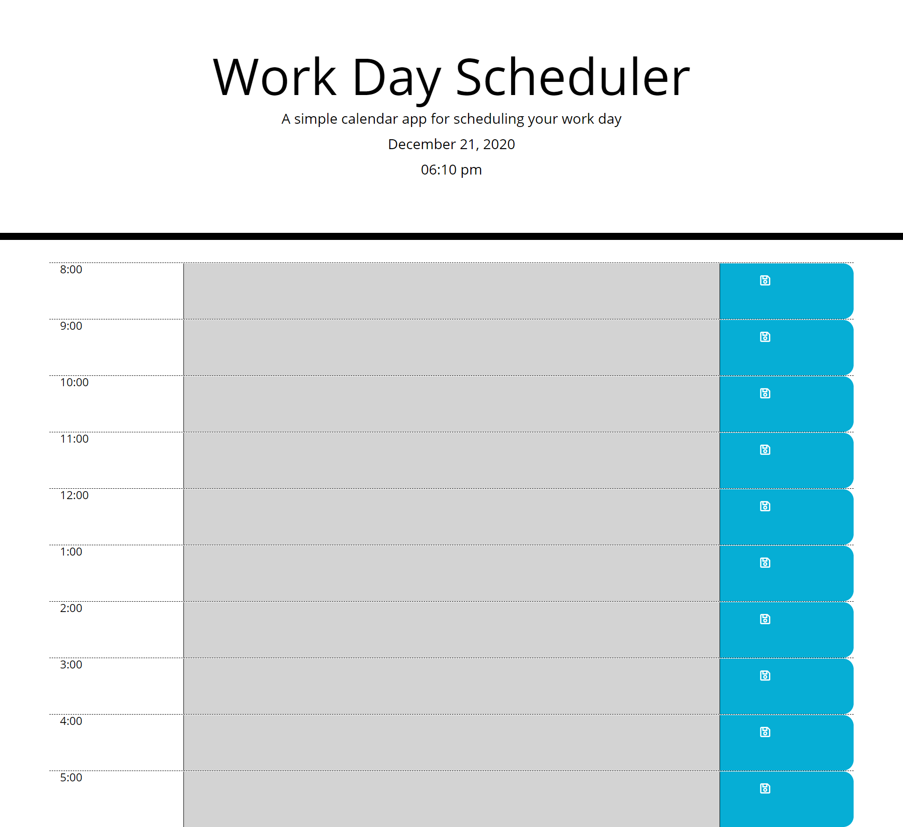

# day_planner

Day Planner 

For this project, I created a day planner to help the user organize thier list of tasks for the day. By using day.js, the site pulls the current date and time and displays it at the top of the screen. Each hour of the workday gets its own row which displays the hour, has a text area that can be filled in with tasks, and a save button to save your tasks for later. The page uses local storage to save the users tasks, so each field will continue to be filled out until the user deletes item off the list and saves the field again. Each row is also color coded based on the current time of day. If a rows time is in the future it will be green, the present it will be red, and the past it will be gray. This feature helps the user intuitively know where they are at during the day, and what they have coming up. 

This project was challenging, but also very rewarding. The end product is a very useful site that can help the user orgainize thier schedule. I relied on using jQuery for the script in this project. Though I have not used in an assignment before, I thought it was very intuitive and helped the coding process go much more quickly and smoothly. I have provided a screenshot below (please note that all the fields are gray in the screen shot due to the time of day it was taken. If it had been taken between 8 and 5 there would also be green and red fields.) I am also including the links for the github repository where this project is housed and a link to the deployed site. 

Repository:
https://github.com/ejsmith13/day_planner

Deployed site:
https://ejsmith13.github.io/day_planner/

